# 🎬 Mini Video Streaming Platform

**A YouTube/Twitch-style streaming pipeline, built from scratch** — chunked resumable uploads, FFmpeg transcoding, and adaptive bitrate HLS delivery, with zero third-party streaming SDKs.


> Most portfolio projects are CRUD apps with a database. This one processes binary data, runs a background transcoding pipeline, and streams video the same way real platforms do — because media infrastructure is where most web developers have never had to go.

---

## 🎥 Demo

<!--
  Record a 15–20s screen capture of: choosing a file → upload progress →
  transcode progress → adaptive playback, then drop the GIF/MP4 here.
  Tools: ScreenToGif (Windows), Kap (Mac), or Peek (Linux).
-->

``

---

## Why this project

Four things separate a real streaming pipeline from a basic file upload form — and this project implements all four, end to end, tested with real video:

| # | Hard part | What it actually requires |
|---|-----------|---------------------------|
| 1 | **Chunked, resumable uploads** | Splitting large files client-side, tracking received chunks server-side, and resuming after a dropped connection instead of restarting from zero |
| 2 | **FFmpeg transcoding pipeline** | Probing source resolution and generating multiple renditions (1080p → 360p) without ever upscaling a low-res source |
| 3 | **Adaptive bitrate streaming (HLS)** | A master playlist referencing per-resolution variant playlists, so the player switches quality automatically as bandwidth changes |
| 4 | **Range requests + CDN-style caching** | Manual `HTTP 206 Partial Content` handling for scrubbing, plus `Cache-Control: immutable` on segments vs. `no-cache` on playlists |

---

## Architecture

```mermaid
flowchart LR
    A["Browser<br/>splits file into 5MB chunks"] -->|POST /api/upload/chunk| B["Express<br/>tracks received chunks"]
    B -->|all chunks received| C["Assemble to raw/*.mp4"]
    C --> D["ffprobe: detect source resolution"]
    D --> E["FFmpeg: transcode into N renditions<br/>(skip upscaling)"]
    E --> F["Write HLS master + variant playlists"]
    F --> G["Static server<br/>immutable cache on .ts segments"]
    G -->|adaptive bitrate| H["hls.js player<br/>in browser"]
```



---

## Tech stack

**Backend:** Node.js, Express, Multer (chunked uploads), fluent-ffmpeg
**Video:** FFmpeg / ffprobe, HLS (HTTP Live Streaming)
**Frontend:** Vanilla JS, hls.js (vendored locally — no CDN dependency)

---

## Quick start

**Prerequisites:** Node.js 18+, and [FFmpeg](https://ffmpeg.org/download.html) installed with `ffmpeg`/`ffprobe` available (either on your `PATH`, or via the `FFMPEG_PATH` / `FFPROBE_PATH` env vars — see below).

```bash
npm install
npm start
```

Open **http://localhost:3000**, choose a video file, and click **Upload & Transcode**.

### Windows notes

If `ffmpeg -version` doesn't work in a fresh terminal after installing FFmpeg (a common `winget`/PATH quirk), skip PATH entirely and set the binaries directly:

```powershell
$env:FFMPEG_PATH="C:\path\to\ffmpeg.exe"
$env:FFPROBE_PATH="C:\path\to\ffprobe.exe"
npm start
```

Or just run the included `start-windows.bat`, which does this for you.

---

## Project structure

```
video-streaming-platform/
├── server.js              # Express app: upload, transcode pipeline, serving
├── public/
│   ├── index.html          # Upload UI + hls.js player
│   └── vendor/hls.min.js   # Vendored locally — works with no internet access
├── start-windows.bat        # One-shot FFmpeg env setup + server start (Windows)
├── tmp/                     # Scratch space for in-flight chunk uploads
├── raw/                     # Assembled original uploads
└── videos/<id>/             # HLS output: master.m3u8 + one folder per rendition
```

---

## API reference

| Method | Endpoint | Description |
|--------|----------|--------------|
| `POST` | `/api/upload/init` | Start an upload session; returns an `uploadId` |
| `GET`  | `/api/upload/status/:uploadId` | Which chunks the server already has (for resuming) |
| `POST` | `/api/upload/chunk` | Upload a single chunk |
| `POST` | `/api/upload/complete` | Assemble chunks and kick off transcoding |
| `GET`  | `/api/videos/:videoId/status` | Poll transcode progress per rendition |
| `GET`  | `/videos/:videoId/master.m3u8` | HLS master playlist (adaptive bitrate) |
| `GET`  | `/raw/:videoId` | Original file with manual range-request support |

---

## Limits

- **2GB** per file, **5MB** per chunk — both enforced server-side, both configurable in `server.js`
- Transcodes one video at a time (single-process queue) — fine for a demo, not for production load

---

## What I'd add for production

This is built to demo cleanly and hold up in a technical interview — not to survive real traffic as-is:

- Swap the in-memory upload/job tracking for Redis or a database
- Replace the single-process transcode loop with a real job queue (BullMQ/SQS) for parallel transcoding across workers
- Put `videos/` behind an actual CDN (CloudFront/Cloudflare) in front of the cache headers already set here
- Add authentication and per-user ownership checks on videos

---

## License

MIT — use this however's useful to you.
